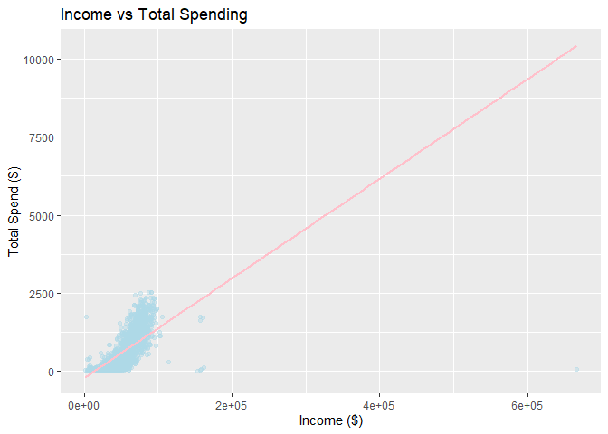
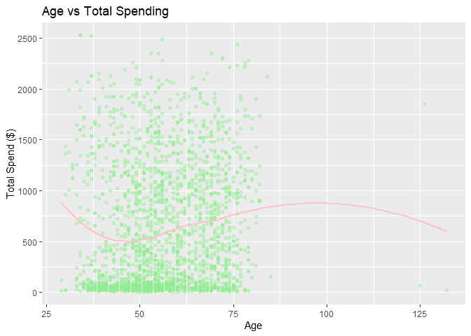
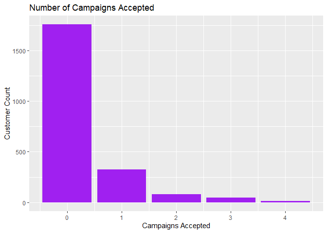
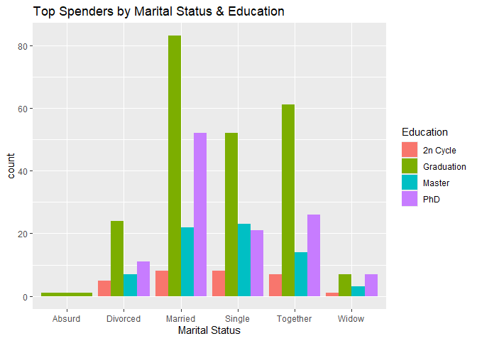
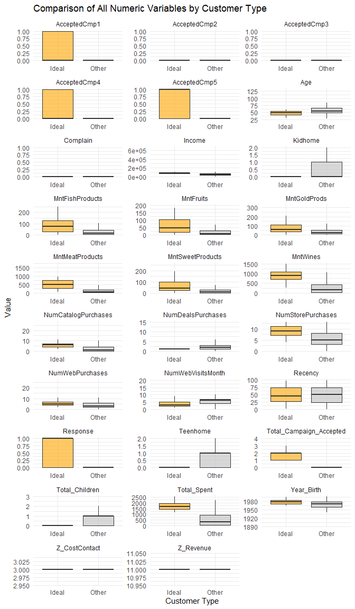

DS2020 Final Project Team 29
================
Laura Arazan
2025-05-12

## Customer Personality Analysis

### Introduction

This dataset is a collection of information on a company’s customers. I
found it on kaggle distributed by Dr. Omar Romero-Hernandez. I am
interested in discovering how to best find a specific set of information
(in this case customers) that best fits a set of requirements (in this
case the most beneficial customers to a company). While testing on this
dataset I will be able to narrow what the most useful tools to me are
and gaining familiarity using them. I think this dataset is similar to
what a company could give me in the future with the same goal of finding
the best candidates to focus their attention on.

I will be reading the data in, cleaning it, looking for points of
interest and familiarizing myself with the format and data, exploring
different relationships between data points, comparing models, and
narrowing down candidates until I find a set of data points that best
fit what a company’s ideal customer is composed of.

The final result could be used for a marketing or ad campaign targeting
the most effective group of customers in this company.

The data has a couple points of concern that I noticed; there isn’t a
range on when the data was collected or how it was collected, one of the
options for Marital_Status is called “absurd”, there isn’t any data on
customers with a maximum education below a bachelor’s degree, no
location(s) are given, and there is no explanation given for what types
of discounts customers used or what type of campaign(s) they accepted.

### Data

Since the data is in a csv file on kaggle I downloaded it and read it in
using the readr library in R.

``` r
library(tidyverse)
```

    ## ── Attaching core tidyverse packages ──────────────────────── tidyverse 2.0.0 ──
    ## ✔ dplyr     1.1.4     ✔ readr     2.1.5
    ## ✔ forcats   1.0.0     ✔ stringr   1.5.1
    ## ✔ ggplot2   3.5.1     ✔ tibble    3.2.1
    ## ✔ lubridate 1.9.4     ✔ tidyr     1.3.1
    ## ✔ purrr     1.0.4     
    ## ── Conflicts ────────────────────────────────────────── tidyverse_conflicts() ──
    ## ✖ dplyr::filter() masks stats::filter()
    ## ✖ dplyr::lag()    masks stats::lag()
    ## ℹ Use the conflicted package (<http://conflicted.r-lib.org/>) to force all conflicts to become errors

``` r
library(readr)
library(ggplot2)
```

Then, I read it into R and ran the dataset through some functions to get
a better understanding of it.

``` r
df <- read_delim("marketing_campaign.csv", delim = "\t")
```

    ## Rows: 2240 Columns: 29
    ## ── Column specification ────────────────────────────────────────────────────────
    ## Delimiter: "\t"
    ## chr  (3): Education, Marital_Status, Dt_Customer
    ## dbl (26): ID, Year_Birth, Income, Kidhome, Teenhome, Recency, MntWines, MntF...
    ## 
    ## ℹ Use `spec()` to retrieve the full column specification for this data.
    ## ℹ Specify the column types or set `show_col_types = FALSE` to quiet this message.

``` r
summary(df)
```

    ##        ID          Year_Birth    Education         Marital_Status    
    ##  Min.   :    0   Min.   :1893   Length:2240        Length:2240       
    ##  1st Qu.: 2828   1st Qu.:1959   Class :character   Class :character  
    ##  Median : 5458   Median :1970   Mode  :character   Mode  :character  
    ##  Mean   : 5592   Mean   :1969                                        
    ##  3rd Qu.: 8428   3rd Qu.:1977                                        
    ##  Max.   :11191   Max.   :1996                                        
    ##                                                                      
    ##      Income          Kidhome          Teenhome      Dt_Customer       
    ##  Min.   :  1730   Min.   :0.0000   Min.   :0.0000   Length:2240       
    ##  1st Qu.: 35303   1st Qu.:0.0000   1st Qu.:0.0000   Class :character  
    ##  Median : 51382   Median :0.0000   Median :0.0000   Mode  :character  
    ##  Mean   : 52247   Mean   :0.4442   Mean   :0.5062                     
    ##  3rd Qu.: 68522   3rd Qu.:1.0000   3rd Qu.:1.0000                     
    ##  Max.   :666666   Max.   :2.0000   Max.   :2.0000                     
    ##  NA's   :24                                                           
    ##     Recency         MntWines         MntFruits     MntMeatProducts 
    ##  Min.   : 0.00   Min.   :   0.00   Min.   :  0.0   Min.   :   0.0  
    ##  1st Qu.:24.00   1st Qu.:  23.75   1st Qu.:  1.0   1st Qu.:  16.0  
    ##  Median :49.00   Median : 173.50   Median :  8.0   Median :  67.0  
    ##  Mean   :49.11   Mean   : 303.94   Mean   : 26.3   Mean   : 166.9  
    ##  3rd Qu.:74.00   3rd Qu.: 504.25   3rd Qu.: 33.0   3rd Qu.: 232.0  
    ##  Max.   :99.00   Max.   :1493.00   Max.   :199.0   Max.   :1725.0  
    ##                                                                    
    ##  MntFishProducts  MntSweetProducts  MntGoldProds    NumDealsPurchases
    ##  Min.   :  0.00   Min.   :  0.00   Min.   :  0.00   Min.   : 0.000   
    ##  1st Qu.:  3.00   1st Qu.:  1.00   1st Qu.:  9.00   1st Qu.: 1.000   
    ##  Median : 12.00   Median :  8.00   Median : 24.00   Median : 2.000   
    ##  Mean   : 37.53   Mean   : 27.06   Mean   : 44.02   Mean   : 2.325   
    ##  3rd Qu.: 50.00   3rd Qu.: 33.00   3rd Qu.: 56.00   3rd Qu.: 3.000   
    ##  Max.   :259.00   Max.   :263.00   Max.   :362.00   Max.   :15.000   
    ##                                                                      
    ##  NumWebPurchases  NumCatalogPurchases NumStorePurchases NumWebVisitsMonth
    ##  Min.   : 0.000   Min.   : 0.000      Min.   : 0.00     Min.   : 0.000   
    ##  1st Qu.: 2.000   1st Qu.: 0.000      1st Qu.: 3.00     1st Qu.: 3.000   
    ##  Median : 4.000   Median : 2.000      Median : 5.00     Median : 6.000   
    ##  Mean   : 4.085   Mean   : 2.662      Mean   : 5.79     Mean   : 5.317   
    ##  3rd Qu.: 6.000   3rd Qu.: 4.000      3rd Qu.: 8.00     3rd Qu.: 7.000   
    ##  Max.   :27.000   Max.   :28.000      Max.   :13.00     Max.   :20.000   
    ##                                                                          
    ##   AcceptedCmp3      AcceptedCmp4      AcceptedCmp5      AcceptedCmp1    
    ##  Min.   :0.00000   Min.   :0.00000   Min.   :0.00000   Min.   :0.00000  
    ##  1st Qu.:0.00000   1st Qu.:0.00000   1st Qu.:0.00000   1st Qu.:0.00000  
    ##  Median :0.00000   Median :0.00000   Median :0.00000   Median :0.00000  
    ##  Mean   :0.07277   Mean   :0.07455   Mean   :0.07277   Mean   :0.06429  
    ##  3rd Qu.:0.00000   3rd Qu.:0.00000   3rd Qu.:0.00000   3rd Qu.:0.00000  
    ##  Max.   :1.00000   Max.   :1.00000   Max.   :1.00000   Max.   :1.00000  
    ##                                                                         
    ##   AcceptedCmp2        Complain        Z_CostContact   Z_Revenue 
    ##  Min.   :0.00000   Min.   :0.000000   Min.   :3     Min.   :11  
    ##  1st Qu.:0.00000   1st Qu.:0.000000   1st Qu.:3     1st Qu.:11  
    ##  Median :0.00000   Median :0.000000   Median :3     Median :11  
    ##  Mean   :0.01339   Mean   :0.009375   Mean   :3     Mean   :11  
    ##  3rd Qu.:0.00000   3rd Qu.:0.000000   3rd Qu.:3     3rd Qu.:11  
    ##  Max.   :1.00000   Max.   :1.000000   Max.   :3     Max.   :11  
    ##                                                                 
    ##     Response     
    ##  Min.   :0.0000  
    ##  1st Qu.:0.0000  
    ##  Median :0.0000  
    ##  Mean   :0.1491  
    ##  3rd Qu.:0.0000  
    ##  Max.   :1.0000  
    ## 

``` r
head(df)
```

    ## # A tibble: 6 × 29
    ##      ID Year_Birth Education  Marital_Status Income Kidhome Teenhome Dt_Customer
    ##   <dbl>      <dbl> <chr>      <chr>           <dbl>   <dbl>    <dbl> <chr>      
    ## 1  5524       1957 Graduation Single          58138       0        0 04-09-2012 
    ## 2  2174       1954 Graduation Single          46344       1        1 08-03-2014 
    ## 3  4141       1965 Graduation Together        71613       0        0 21-08-2013 
    ## 4  6182       1984 Graduation Together        26646       1        0 10-02-2014 
    ## 5  5324       1981 PhD        Married         58293       1        0 19-01-2014 
    ## 6  7446       1967 Master     Together        62513       0        1 09-09-2013 
    ## # ℹ 21 more variables: Recency <dbl>, MntWines <dbl>, MntFruits <dbl>,
    ## #   MntMeatProducts <dbl>, MntFishProducts <dbl>, MntSweetProducts <dbl>,
    ## #   MntGoldProds <dbl>, NumDealsPurchases <dbl>, NumWebPurchases <dbl>,
    ## #   NumCatalogPurchases <dbl>, NumStorePurchases <dbl>,
    ## #   NumWebVisitsMonth <dbl>, AcceptedCmp3 <dbl>, AcceptedCmp4 <dbl>,
    ## #   AcceptedCmp5 <dbl>, AcceptedCmp1 <dbl>, AcceptedCmp2 <dbl>, Complain <dbl>,
    ## #   Z_CostContact <dbl>, Z_Revenue <dbl>, Response <dbl>

``` r
str(df)
```

    ## spc_tbl_ [2,240 × 29] (S3: spec_tbl_df/tbl_df/tbl/data.frame)
    ##  $ ID                 : num [1:2240] 5524 2174 4141 6182 5324 ...
    ##  $ Year_Birth         : num [1:2240] 1957 1954 1965 1984 1981 ...
    ##  $ Education          : chr [1:2240] "Graduation" "Graduation" "Graduation" "Graduation" ...
    ##  $ Marital_Status     : chr [1:2240] "Single" "Single" "Together" "Together" ...
    ##  $ Income             : num [1:2240] 58138 46344 71613 26646 58293 ...
    ##  $ Kidhome            : num [1:2240] 0 1 0 1 1 0 0 1 1 1 ...
    ##  $ Teenhome           : num [1:2240] 0 1 0 0 0 1 1 0 0 1 ...
    ##  $ Dt_Customer        : chr [1:2240] "04-09-2012" "08-03-2014" "21-08-2013" "10-02-2014" ...
    ##  $ Recency            : num [1:2240] 58 38 26 26 94 16 34 32 19 68 ...
    ##  $ MntWines           : num [1:2240] 635 11 426 11 173 520 235 76 14 28 ...
    ##  $ MntFruits          : num [1:2240] 88 1 49 4 43 42 65 10 0 0 ...
    ##  $ MntMeatProducts    : num [1:2240] 546 6 127 20 118 98 164 56 24 6 ...
    ##  $ MntFishProducts    : num [1:2240] 172 2 111 10 46 0 50 3 3 1 ...
    ##  $ MntSweetProducts   : num [1:2240] 88 1 21 3 27 42 49 1 3 1 ...
    ##  $ MntGoldProds       : num [1:2240] 88 6 42 5 15 14 27 23 2 13 ...
    ##  $ NumDealsPurchases  : num [1:2240] 3 2 1 2 5 2 4 2 1 1 ...
    ##  $ NumWebPurchases    : num [1:2240] 8 1 8 2 5 6 7 4 3 1 ...
    ##  $ NumCatalogPurchases: num [1:2240] 10 1 2 0 3 4 3 0 0 0 ...
    ##  $ NumStorePurchases  : num [1:2240] 4 2 10 4 6 10 7 4 2 0 ...
    ##  $ NumWebVisitsMonth  : num [1:2240] 7 5 4 6 5 6 6 8 9 20 ...
    ##  $ AcceptedCmp3       : num [1:2240] 0 0 0 0 0 0 0 0 0 1 ...
    ##  $ AcceptedCmp4       : num [1:2240] 0 0 0 0 0 0 0 0 0 0 ...
    ##  $ AcceptedCmp5       : num [1:2240] 0 0 0 0 0 0 0 0 0 0 ...
    ##  $ AcceptedCmp1       : num [1:2240] 0 0 0 0 0 0 0 0 0 0 ...
    ##  $ AcceptedCmp2       : num [1:2240] 0 0 0 0 0 0 0 0 0 0 ...
    ##  $ Complain           : num [1:2240] 0 0 0 0 0 0 0 0 0 0 ...
    ##  $ Z_CostContact      : num [1:2240] 3 3 3 3 3 3 3 3 3 3 ...
    ##  $ Z_Revenue          : num [1:2240] 11 11 11 11 11 11 11 11 11 11 ...
    ##  $ Response           : num [1:2240] 1 0 0 0 0 0 0 0 1 0 ...
    ##  - attr(*, "spec")=
    ##   .. cols(
    ##   ..   ID = col_double(),
    ##   ..   Year_Birth = col_double(),
    ##   ..   Education = col_character(),
    ##   ..   Marital_Status = col_character(),
    ##   ..   Income = col_double(),
    ##   ..   Kidhome = col_double(),
    ##   ..   Teenhome = col_double(),
    ##   ..   Dt_Customer = col_character(),
    ##   ..   Recency = col_double(),
    ##   ..   MntWines = col_double(),
    ##   ..   MntFruits = col_double(),
    ##   ..   MntMeatProducts = col_double(),
    ##   ..   MntFishProducts = col_double(),
    ##   ..   MntSweetProducts = col_double(),
    ##   ..   MntGoldProds = col_double(),
    ##   ..   NumDealsPurchases = col_double(),
    ##   ..   NumWebPurchases = col_double(),
    ##   ..   NumCatalogPurchases = col_double(),
    ##   ..   NumStorePurchases = col_double(),
    ##   ..   NumWebVisitsMonth = col_double(),
    ##   ..   AcceptedCmp3 = col_double(),
    ##   ..   AcceptedCmp4 = col_double(),
    ##   ..   AcceptedCmp5 = col_double(),
    ##   ..   AcceptedCmp1 = col_double(),
    ##   ..   AcceptedCmp2 = col_double(),
    ##   ..   Complain = col_double(),
    ##   ..   Z_CostContact = col_double(),
    ##   ..   Z_Revenue = col_double(),
    ##   ..   Response = col_double()
    ##   .. )
    ##  - attr(*, "problems")=<externalptr>

Here I condensed variables into; Age, Total_Children, Total_Spent, and
Total_Campaign_Accepted.

``` r
df$Age <- 2025 - df$Year_Birth
df$Total_Children <- df$Kidhome + df$Teenhome
df$Total_Spent <- rowSums(df[, c("MntWines", "MntFruits", "MntMeatProducts", 
                                 "MntFishProducts", "MntSweetProducts", "MntGoldProds")])
df$Total_Campaign_Accepted <- rowSums(df[, c("AcceptedCmp1", "AcceptedCmp2", 
                                             "AcceptedCmp3", "AcceptedCmp4", "AcceptedCmp5")])
```

Afterwards, I cleaned the data by checking for any missing or null
values. Seeing income only had 24 missing values out of 2240 data
points, I proceeded to cut the missing rows out of the dataset.

``` r
missing <- colSums(is.na(df))
missing[missing > 0]
```

    ## Income 
    ##     24

``` r
summary(df$Income)
```

    ##    Min. 1st Qu.  Median    Mean 3rd Qu.    Max.    NA's 
    ##    1730   35303   51382   52247   68522  666666      24

``` r
df <- df %>% drop_na(Income)
missing <- colSums(is.na(df))
missing[missing > 0]
```

    ## named numeric(0)

Then I explored the relationships between categories that stood out to
me, including; income vs total spent, age vs total spent, and how many
customers accepted this company’s campaigns.

``` r
ggplot(df, aes(x = Income, y = Total_Spent)) +
  geom_point(alpha = 0.4, color = "lightblue") +
  geom_smooth(method = "lm", color = "pink", se = FALSE) +
  labs(title = "Income vs Total Spending", x = "Income ($)", y = "Total Spend ($)")
```

    ## `geom_smooth()` using formula = 'y ~ x'

<!-- -->

``` r
ggplot(df, aes(x = Age, y = Total_Spent)) +
  geom_point(alpha = 0.4, color = "lightgreen") +
  geom_smooth(method = "loess", color = "pink", se = FALSE) +
  labs(title = "Age vs Total Spending", x = "Age", y = "Total Spend ($)")
```

    ## `geom_smooth()` using formula = 'y ~ x'

<!-- -->

``` r
ggplot(df, aes(x = Total_Campaign_Accepted)) +
  geom_bar(fill = "purple") +
  labs(title = "Number of Campaigns Accepted", x = "Campaigns Accepted", y = "Customer Count")
```

<!-- -->

I discovered the top 20% of customers by filtering customers that were
in the top 20% of money spent at this company. Then, I made a plot of
the top spending customers and compared their marital status vs their
education.

``` r
top_spenders <- df %>% 
  filter(Total_Spent > quantile(Total_Spent, 0.80))

ggplot(top_spenders, aes(x = Marital_Status, fill = Education)) +
  geom_bar(position = "dodge") +
  labs(title = "Top Spenders by Marital Status & Education", x = "Marital Status")
```

<!-- -->

What does an ideal customer look like? Here I filtered the top 20% of
spending customers, who accepted at least one campaign, were from 30 to
60 (inclusive), and had a median income at or above that of all of the
customers sampled.

``` r
ideal <- df %>%
  filter(
    Total_Spent > quantile(Total_Spent, 0.80),
    Total_Campaign_Accepted > 0,
    Age >= 30, Age <= 60,
    Income >= median(Income, na.rm=TRUE)
  )

summary(ideal)
```

    ##        ID          Year_Birth    Education         Marital_Status    
    ##  Min.   :  175   Min.   :1965   Length:136         Length:136        
    ##  1st Qu.: 2571   1st Qu.:1971   Class :character   Class :character  
    ##  Median : 5049   Median :1977   Mode  :character   Mode  :character  
    ##  Mean   : 5228   Mean   :1977                                        
    ##  3rd Qu.: 7748   3rd Qu.:1983                                        
    ##  Max.   :10872   Max.   :1995                                        
    ##      Income          Kidhome           Teenhome      Dt_Customer       
    ##  Min.   : 51563   Min.   :0.00000   Min.   :0.0000   Length:136        
    ##  1st Qu.: 71952   1st Qu.:0.00000   1st Qu.:0.0000   Class :character  
    ##  Median : 78408   Median :0.00000   Median :0.0000   Mode  :character  
    ##  Mean   : 78312   Mean   :0.05882   Mean   :0.1765                     
    ##  3rd Qu.: 84281   3rd Qu.:0.00000   3rd Qu.:0.0000                     
    ##  Max.   :105471   Max.   :1.00000   Max.   :1.0000                     
    ##     Recency         MntWines        MntFruits      MntMeatProducts
    ##  Min.   : 1.00   Min.   : 267.0   Min.   :  0.00   Min.   : 45.0  
    ##  1st Qu.:26.75   1st Qu.: 710.8   1st Qu.: 19.00   1st Qu.:272.0  
    ##  Median :44.50   Median : 904.5   Median : 46.00   Median :501.5  
    ##  Mean   :49.40   Mean   : 884.9   Mean   : 63.24   Mean   :500.3  
    ##  3rd Qu.:74.00   3rd Qu.:1068.5   3rd Qu.:102.75   3rd Qu.:733.5  
    ##  Max.   :98.00   Max.   :1486.0   Max.   :185.00   Max.   :974.0  
    ##  MntFishProducts  MntSweetProducts  MntGoldProds    NumDealsPurchases
    ##  Min.   :  0.00   Min.   :  0.00   Min.   :  0.00   Min.   :0.000    
    ##  1st Qu.: 29.00   1st Qu.: 21.00   1st Qu.: 33.00   1st Qu.:1.000    
    ##  Median : 74.00   Median : 44.00   Median : 59.50   Median :1.000    
    ##  Mean   : 85.15   Mean   : 64.55   Mean   : 77.06   Mean   :1.272    
    ##  3rd Qu.:126.00   3rd Qu.: 98.25   3rd Qu.:108.00   3rd Qu.:1.000    
    ##  Max.   :250.00   Max.   :194.00   Max.   :245.00   Max.   :4.000    
    ##  NumWebPurchases  NumCatalogPurchases NumStorePurchases NumWebVisitsMonth
    ##  Min.   : 2.000   Min.   : 2.000      Min.   : 4.000    Min.   :1.000    
    ##  1st Qu.: 4.000   1st Qu.: 4.000      1st Qu.: 7.000    1st Qu.:2.000    
    ##  Median : 5.000   Median : 6.000      Median : 9.000    Median :3.000    
    ##  Mean   : 5.559   Mean   : 5.787      Mean   : 8.684    Mean   :3.559    
    ##  3rd Qu.: 7.000   3rd Qu.: 7.000      3rd Qu.:11.000    3rd Qu.:5.000    
    ##  Max.   :11.000   Max.   :11.000      Max.   :13.000    Max.   :9.000    
    ##   AcceptedCmp3     AcceptedCmp4     AcceptedCmp5     AcceptedCmp1   
    ##  Min.   :0.0000   Min.   :0.0000   Min.   :0.0000   Min.   :0.0000  
    ##  1st Qu.:0.0000   1st Qu.:0.0000   1st Qu.:0.0000   1st Qu.:0.0000  
    ##  Median :0.0000   Median :0.0000   Median :1.0000   Median :0.0000  
    ##  Mean   :0.2279   Mean   :0.3603   Mean   :0.6544   Mean   :0.4632  
    ##  3rd Qu.:0.0000   3rd Qu.:1.0000   3rd Qu.:1.0000   3rd Qu.:1.0000  
    ##  Max.   :1.0000   Max.   :1.0000   Max.   :1.0000   Max.   :1.0000  
    ##   AcceptedCmp2        Complain        Z_CostContact   Z_Revenue 
    ##  Min.   :0.00000   Min.   :0.000000   Min.   :3     Min.   :11  
    ##  1st Qu.:0.00000   1st Qu.:0.000000   1st Qu.:3     1st Qu.:11  
    ##  Median :0.00000   Median :0.000000   Median :3     Median :11  
    ##  Mean   :0.08824   Mean   :0.007353   Mean   :3     Mean   :11  
    ##  3rd Qu.:0.00000   3rd Qu.:0.000000   3rd Qu.:3     3rd Qu.:11  
    ##  Max.   :1.00000   Max.   :1.000000   Max.   :3     Max.   :11  
    ##     Response           Age        Total_Children    Total_Spent  
    ##  Min.   :0.0000   Min.   :30.00   Min.   :0.0000   Min.   :1179  
    ##  1st Qu.:0.0000   1st Qu.:42.00   1st Qu.:0.0000   1st Qu.:1438  
    ##  Median :1.0000   Median :48.00   Median :0.0000   Median :1654  
    ##  Mean   :0.5074   Mean   :47.53   Mean   :0.2353   Mean   :1675  
    ##  3rd Qu.:1.0000   3rd Qu.:54.25   3rd Qu.:0.0000   3rd Qu.:1919  
    ##  Max.   :1.0000   Max.   :60.00   Max.   :2.0000   Max.   :2525  
    ##  Total_Campaign_Accepted
    ##  Min.   :1.000          
    ##  1st Qu.:1.000          
    ##  Median :2.000          
    ##  Mean   :1.794          
    ##  3rd Qu.:2.000          
    ##  Max.   :4.000

``` r
df_seperated_customers <- df %>%
  mutate(
    Ideal_Customer = ifelse(
      Total_Spent > quantile(Total_Spent, 0.80, na.rm = TRUE) &
      Total_Campaign_Accepted > 0 &
      Age >= 30 & Age <= 60 &
      Income >= median(Income, na.rm = TRUE),
      "Ideal", "Other"
    )
  )

# Select numeric columns (excluding ID)
numeric_cols <- df_seperated_customers %>%
  select(where(is.numeric)) %>%
  select(-ID) %>%
  colnames()

# Reshape to long format
df_long <- df_seperated_customers %>%
  select(all_of(numeric_cols), Ideal_Customer) %>%
  pivot_longer(
    cols = -Ideal_Customer,
    names_to = "Variable",
    values_to = "Value"
  )

# Plot faceted boxplots
ggplot(df_long, aes(x = Ideal_Customer, y = Value, fill = Ideal_Customer)) +
  geom_boxplot(outlier.shape = NA, alpha = 0.6) +
  facet_wrap(~ Variable, scales = "free", ncol = 3) +
  labs(title = "Comparison of All Numeric Variables by Customer Type",
       x = "Customer Type", y = "Value") +
  scale_fill_manual(values = c("Ideal" = "orange", "Other" = "gray")) +
  theme_minimal(base_size = 11) +
  theme(legend.position = "none")
```

<!-- -->

Idea customers are most likely

- Aged 30–60

- Spend a lot across product categories

- Responsive to campaigns

- Mid-to-high income

- Educated and likely married
